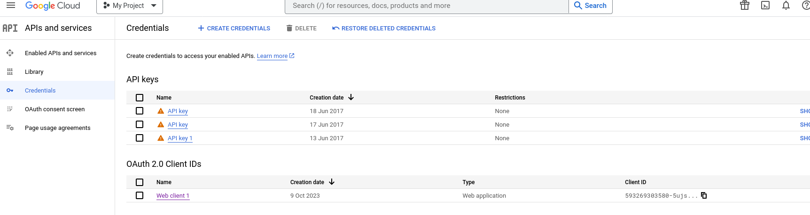
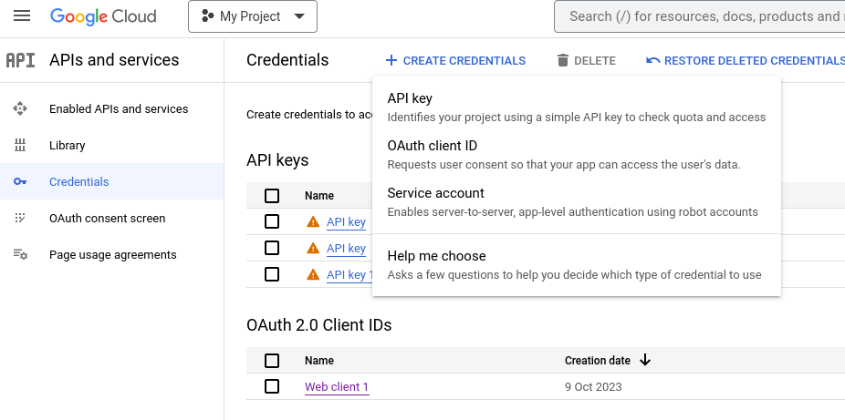
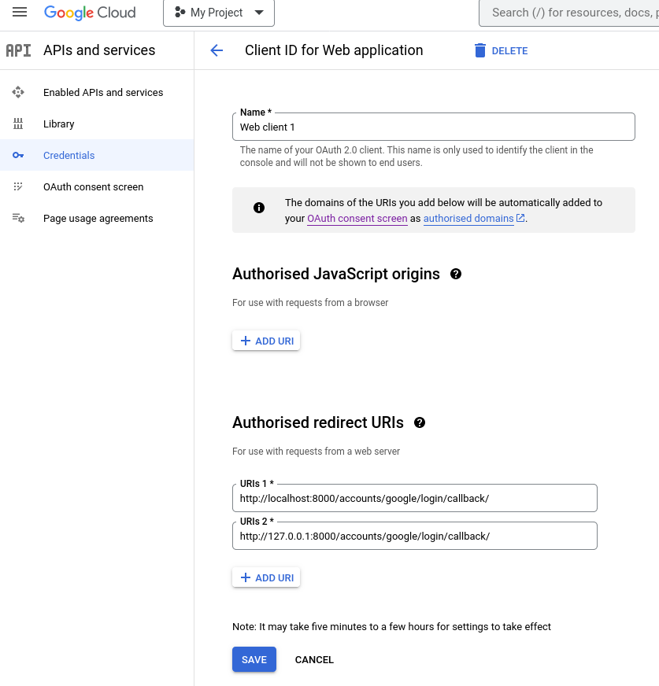
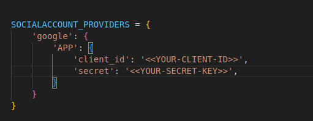
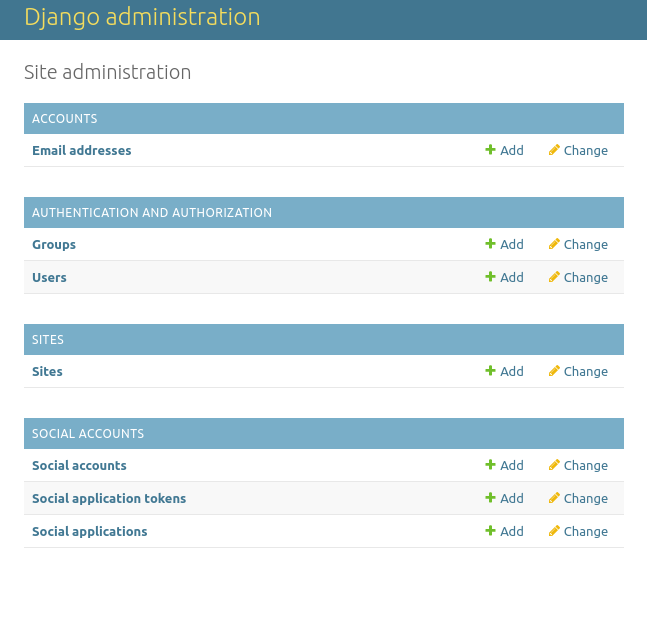
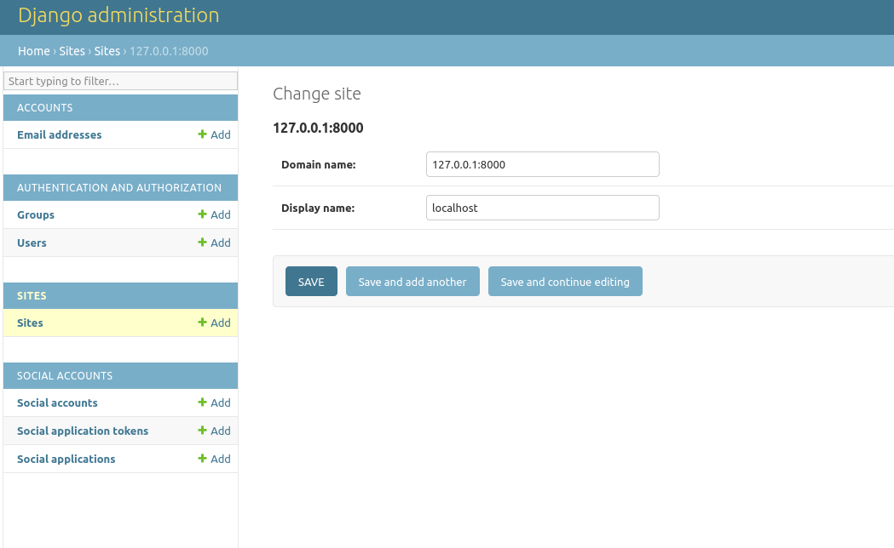
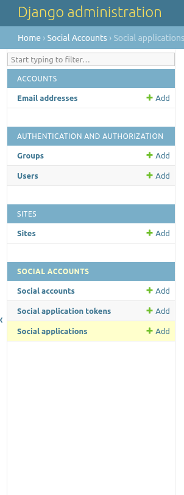
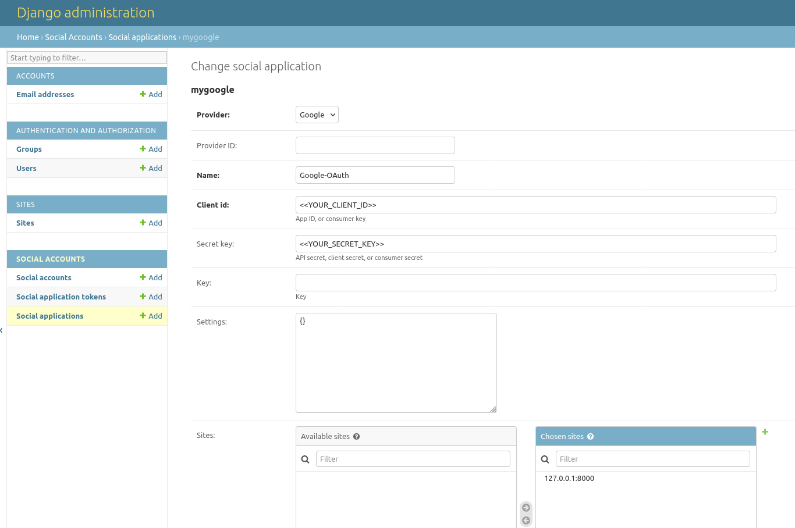

# Note:
1. SQLite must be installed
2. Python must be installed (preferably using anaconda)

## Installation of backend:

1. (Optional) Create a new virtual environment using the command: ```conda create ENVNAME python=PYTHON-VERSION```, here ENVNAME is your environment name and PYTHON-VERSION is the desired python version (for ex: ```conda create myenv python=3.8```).
2. To optionally clone an existing environment use the command: ```conda create ENVNAME python=PYTHON-VERSION –clone EXISTING```.
3. Activate the virtual environment as: ```conda activate ENVNAME```
4. In the backend directory, install all the required packages using the command: ```pip install -r requirements.txt```
5. Install the spacy language model using the command: ```python -m spacy en_core_web_md```
6. Run the following commands to do the database migrations:
  ```
python manage.py makemigrations
python manage.py migrate

```
7. Create a superuser using the command: ```python manage.py createsuperuser``` and follow the prompts ahead.
8. Setup the Google Oauth locally as follows:
    1. Go to the URL: https://console.cloud.google.com/apis/ and create a new project.
    2. Under the APIs and Services tab click on Credentials:
        <br><br>
    3. Then click the Create Credentials button at the top and select the Oauth Client ID:
        <br><br>
    4. Select the application type as web application, give a suitable name and in the Authorised redirect URIs, add the following URLs:
       http://127.0.0.1:8000/accounts/google/login/callback/ <br>
       http://localhost:8000/accounts/google/login/callback/
        <br><br>
     **Take a note of the OAuth of the Client ID and Client Secret (would be on the right of the page)**
9. Add the client ID and the Client Secret in the settings.py file inside ai_health_monitoring directory as follows: <br><br>
        <br><br>
10. Launch the local development server for django using the command: ```python manage.py runserver``` OR ```daphne ai_health_monitoring.asgi:application```
11. Navigate to the admin url: **localhost:8000/admin** OR **127.0.0.1:8000/admin**
12. Use the credentials created in step 7 above.
    <br><br>
     <br><br>
14. Go to sites tab and create a site (display name can be anything here and then click on save):
    <br><br>
    
15. Go to the social applications tab and create a new social application and fill the details (Make sure to use the same client ID and client secret retrieved as part of step 10, choose the created site from list of sites and click on save) :
    <br><br>
    
    <br> <br>
    
     <br><br>
16. Logout from the django admin console, restart the server using command: ```python manage.py runserver``` OR ```daphne ai_health_monitoring.asgi:application```. The google authentication should work now.
    **Note:** Make sure the django server is currently running on the port 8000, else run it as ```python manage.py runserver 8000``` OR ```daphne -p 8000 ai_health_monitoring.asgi:application```. This must be the same port number added to redirection URIs in the google cloud API.
